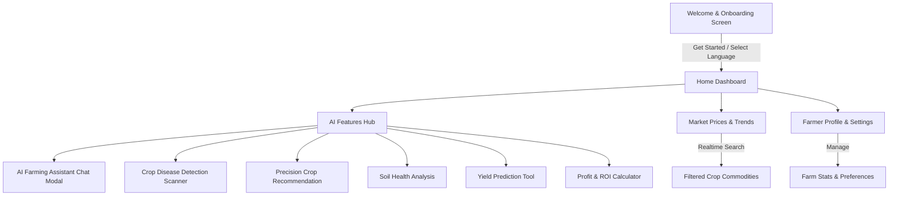

# 🌾 CropAI - Smart Farming & Agricultural Intelligence

<div align="center">

[](https://developer.mozilla.org/en-US/docs/Web/HTML)
[](https://developer.mozilla.org/en-US/docs/Web/CSS)
[](https://developer.mozilla.org/en-US/docs/Web/JavaScript)
[](https://github.com)
[](https://github.com)

**An intelligent, multi-lingual agricultural companion empowering farmers with machine learning diagnostics, crop recommendations, yield forecasting, and market intelligence.**

[Explore Features](#-key-features) • [Liquid Glass UI](#-liquid-glass-design-system) • [Project Structure](#-project-structure) • [Getting Started](#-getting-started)

</div>

---

## 📖 Overview

**CropAI** is a modern, responsive web application engineered to solve real-world agricultural challenges. By merging data-driven agronomy with intuitive mobile-first interfaces, CropAI gives farmers immediate access to predictive tools, disease diagnostics, real-time commodity pricing, and a 24/7 AI agricultural advisor.

---

## ✨ Key Features

### 1. 🤖 24/7 AI Agricultural Assistant
- Interactive AI chatbot delivering customized agronomic guidance.
- Tailored recommendations on fertilizer timing, pest management, and market timing based on plot conditions and regional weather data.

### 2. 🔬 AI Crop Disease Detection
- Optical leaf diagnostic scanner simulation.
- Real-time disease identification (e.g., *Tomato Late Blight*, *Wheat Powdery Mildew*, *Cotton Bacterial Blight*) complete with confidence scores, severity ratings, and symptom breakdowns.

### 3. 🌱 Precision Crop Recommendation Engine
- Recommends the highest-yielding crop variety based on soil NPK levels (Nitrogen, Phosphorus, Potassium), soil pH, annual rainfall, and average ambient temperature.

### 4. 📈 Real-Time Commodity Market Prices
- Live commodity trade price tracking (Wheat, Basmati Rice, Cotton, Sugarcane, Maize, Soybean) per quintal.
- Dynamic sparkline trend charts and instant search/filtering by crop name.

### 5. 🚜 Yield Prediction & Forecasting
- Calculates expected harvest volume (in Quintals) based on selected crop variety, plot acreage, soil classification (Black, Clay, Loam, Sandy), and irrigation setup (Drip, Sprinkler, Flood).

### 6. 💰 Farm Profit & ROI Calculator
- Interactive financial modeling tool calculating Total Revenue, Operating Costs, Net Profit, Margin percentage, and Return on Investment (ROI) multiplier with visual cost/profit distribution bars.

### 7. 🧪 Soil Health & Nutrient Analysis
- Circular SVG health gauge scoring soil vitality from 0 to 100.
- Dynamic NPK deficiency indicators and automated crop suitability suggestions.

### 8. 🌐 Multi-Language Support
- Localized onboarding experience supporting English, ગુજરાતી (Gujarati), मराठी (Marathi), हिन्दी (Hindi), and తెలుగు (Telugu).

---

## 💎 Liquid Glass Design System

CropAI utilizes an ultra-modern **Liquid Glass (VisionOS / Liquid Glassmorphism)** design aesthetic:

- **Specular Meniscus Reflections**: Specially crafted pseudo-elements (`::before`) creating an organic convex liquid reflection lens across interactive controls.
- **Ambient Caustic Refraction**: Subtle bottom edge light dispersion (`::after`) mimicking light passing through dense crystal glass droplets.
- **Multi-Layer Depth**: Layered inset highlights, diffuse drop-shadows, and high-saturation backdrop blurs (`backdrop-filter: blur(16px)`).
- **Fluid Micro-Animations**: Smooth buoyant lift on hover, interactive haptic-style depression on tap, and seamless transitions.
- **Mobile Device Shell Frame**: Optimized for mobile devices with an elegant centered device chassis on wide desktop screens.

---

## 📱 Application Screens & Workflow



---

## 📂 Project Structure

```bash
Agro-ai/
├── index.html              # Main Single-Page Application (SPA) structure & interactive logic
├── main.css                # Unified Responsive Design System & Liquid Glass styling
├── SFPRODISPLAYMEDIUM.OTF  # Custom SF Pro Display typography asset
└── README.md               # Project documentation and feature guide
```

---

## 🚀 Getting Started

No build tools or heavy installations required! CropAI is built with pure Vanilla HTML, CSS, and JavaScript for maximum speed and zero dependencies.

### Prerequisites
- Any modern web browser (Google Chrome, Mozilla Firefox, Microsoft Edge, Apple Safari).

### Quick Launch

1. **Clone the repository:**
   ```bash
   git clone https://github.com/oye-rahul/AI-Smart-Farming.git
   cd AI-Smart-Farming
   ```

2. **Open in browser:**
   - Simply double click `index.html` or open it with Live Server in VS Code / Antigravity.
   - Alternatively, serve locally using Python:
     ```bash
     # Python 3
     python -m http.server 8000
     ```
   - Open [http://localhost:8000](http://localhost:8000) in your browser.

---

## 🛠️ Tech Stack

| Component | Technology | Purpose |
| :--- | :--- | :--- |
| **Markup** | HTML5 Semantic Elements | High-performance SPA shell and accessibility |
| **Styling** | Vanilla CSS3 (Custom Properties) | Liquid glassmorphism, responsive flex/grid layouts, animations |
| **Typography** | SF Pro Display & Google Fonts (Inter, Manrope) | Modern, clean readability across mobile and desktop |
| **Logic** | Vanilla JavaScript (ES6+) | Real-time calculation engines, search filters, interactive navigation |
| **Graphics** | Native Vector SVGs | Crisp resolution-independent iconography and trend sparklines |

---

## 🤝 Contributing

Contributions, feedback, and feature suggestions are welcome!
1. Fork the Project
2. Create your Feature Branch (`git checkout -b feature/AmazingFeature`)
3. Commit your Changes (`git commit -m 'Add some AmazingFeature'`)
4. Push to the Branch (`git push origin feature/AmazingFeature`)
5. Open a Pull Request

---

## 📄 License

Distributed under the MIT License. See `LICENSE` for more information.

<div align="center">
  <sub>Built with ❤️ for the global farming community.</sub>
</div>
